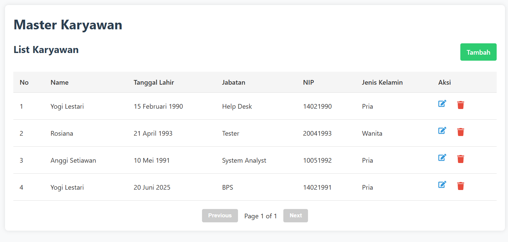
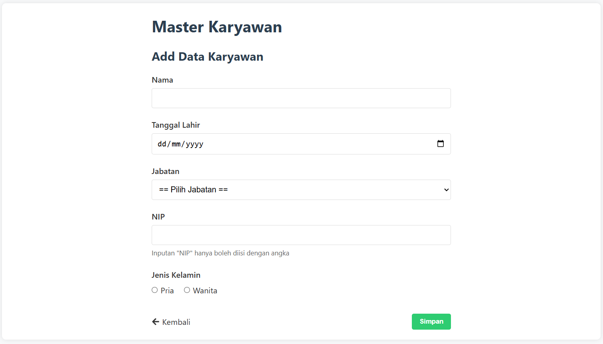
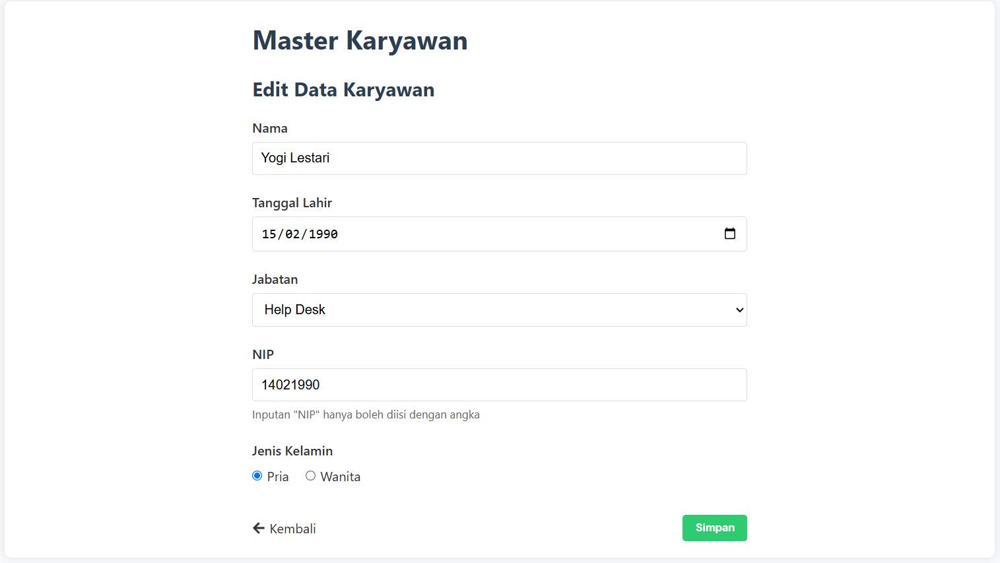
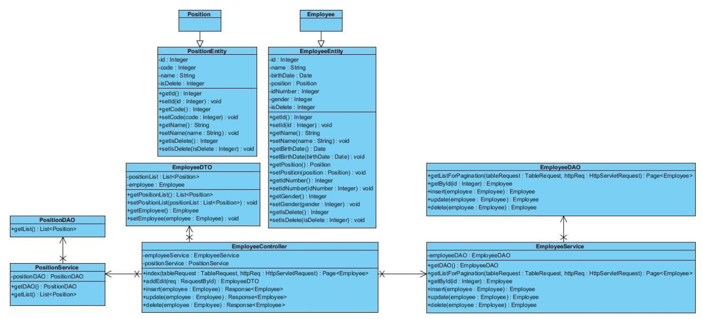
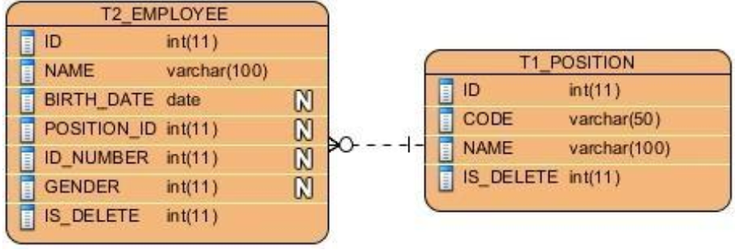

# JAVAKARYA


## DESCRIPTION 

Fullstack CRUD Karyawan App





## SPECIFICATION
- Front End : React Framework
- Backend : Spring Boot
- Use REST API (JSON)
- JPA using Hibernate
- Use HQL
- Database using Postgres
- Backend API : [Employee Controller](./frontend/src/services/EmployeeService.js), [Position Controller](./frontend/src/services/PositionService.js)

## CLASS DIAGRAM


Tabel Position:

| No | Nama Field  | Tipe Data       | Primary Key | Allow Null | Note                                                          |
|----|-------------|-----------------|-------------|------------|---------------------------------------------------------------|
| 1  | ID          | NUMBER          | X           | TIDAK      | Auto Increment                                               |
| 2  | CODE        | VARCHAR(50)     |             | TIDAK      |                                                              |
| 3  | NAME        | VARCHAR(100)    |             | TIDAK      |                                                              |
| 4  | IS_DELETE   | NUMBER          |             | TIDAK      | Flag yang menandakan telah dihapus. 1 : True 0 : False       |

Tabel Employee:

| No | Nama Field   | Tipe Data       | Primary Key | Allow Null | Note                                                                 |
|----|--------------|-----------------|-------------|------------|----------------------------------------------------------------------|
| 1  | ID           | NUMBER          | X           | TIDAK      | Auto Increment                                                       |
| 2  | NAME         | VARCHAR(100)    |             | TIDAK      | Nama Karyawan                                                        |
| 3  | BIRTH_DATE   | DATE            |             | TIDAK      | Tanggal Lahir Karyawan                                               |
| 4  | POSITION_ID  | NUMBER          |             | TIDAK      | Foreign Key ke Tabel T1_JABATAN, field CODE                          |
| 5  | ID_NUMBER    | NUMBER          |             | TIDAK      | Nomor Induk Pegawai                                                  |
| 6  | GENDER       | NUMBER          |             | TIDAK      | 1: Pria<br>2: Wanita                                                 |
| 7  | IS_DELETE    | NUMBER          |             | TIDAK      | Flag yang menandakan telah dihapus.<br>1: True<br>0: False           |

## ENTITY RELATIONSHIP DIAGRAM



## HOW TO RUN
### Requirements
- podman 5.5.2/docker
- java jdk/jre 21
- npm 10.9.2, node v22.17.0 : [package.json](./frontend/package.json)


### 1. Clone project
```sh
git clone https://github.com/azirariza9/javakarya.git &&
cd javakarya
```
### 2. Start PostgreSQL 
```sh
cd backend
docker compose -f compose.yaml up or podman compose -f compose.yaml up
```
### 3. Run Backend Javakarya
Linux : 
```sh
./mvnw springboot:run 
```
Windows :
```sh
.\mvnw.exe springboot:run 
```
### 4. Run Frontend 
```sh
cd frontend
npm run dev
```
### Alternative (Linux only)
just run 
```sh
./dev.sh
```

## LICENSE
- [JAVAKARYA LICENSE](./LICENSE)
